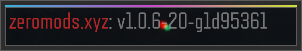

# [xifil](https://github.com/xifil)/[t7-lfx](https://github.com/xifil/t7-lfx)

<!--p align="center">
  
</p-->

NOTE: You must legally own [Call of Duty®: Black Ops III](https://store.steampowered.com/app/311210/) (Steam) to run this mod. Cracked/Pirated versions of the game are **NOT** supported, and neither is the Microsoft Store version.

## Improvements made

Here are some improvements made over the original T7x/BOIII/Ezz BOIII:

  

    Code styling
  

  

    Before, the general code style of this project was as follows:
<pre lang="cpp">
void function_name()
{
    if (condition)
    {
        // ...
    }
&nbsp;
    for (auto x = 0; x < etc; x++)
    {
        // ...
    }
&nbsp;
    if (single_line_condition) return;
&nbsp;
    printf("%s: very long statement!!!!!!!!!!!!!!!!!!!!!!!!!!!!!!!!!!!!!!",
           "string here");
}
</pre>
    For the sake of anyone who wants to dev this (including me), this has been swiftly changed to what (in my opinion) is just a better way to format code.  
    Single line statements have been removed, spacing in long statements trimmed to one tab, brackets don't always go on next line, etc. The same sample code would be as follows:
<pre lang="cpp">
void function_name() {
    if (condition) {
        // ...
    }
&nbsp;
    for (auto x = 0; x < etc; x++) {
        // ...
    }
&nbsp;
    if (single_line_condition) {
        return; // no longer single line
    }
&nbsp;
    printf("%s: very long statement!!!!!!!!!!!!!!!!!!!!!!!!!!!!!!!!!!!!!!",
        "string here");
}
</pre>
  

  

    Deauthorisation mode
  

  

    If you are a comical person and have been robbed of your oh so special (and real 🤨) Steam account with Black Ops III, fear not, you can still use this mod. Simply add <code>-spacewar</code> to the command - you should run the following:  
     
<pre lang="cmd">
boiii.exe -spacewar
</pre>
     
    This works because I have changed the way Steam initialised with this flag, instead using Spacewar as the base app ID instead of Black Ops III. 
     
<pre lang="cpp">
unsigned int utils::GetAppID() {
    static const auto spacewar = ::utils::flags::has_flag("spacewar");
    return spacewar ? 480 /* Spacewar */ : 311210 /* Call of Duty: Black Ops III */;
}
</pre>
  

  

    Client display name
  

  

    You can now change the client name in the top-left corner, and console prefix with one ingame command:  
     
<pre lang="cmd">
client_display_name [name]
</pre>
     
    It will look like this:  
    
  

  

    File verification
  

  

    If you need to verify your files without Steam:  
     
<pre lang="cmd">
boiii.exe -verify
</pre>
     
    After pressing <code>Play</code>, your files will be verified in accordance to <a href="https://github.com/xifil/t7-lfx/blob/main/src/client/component/verifier.cpp">stored hashes in the code</a>.
  

  

    <code>ext.dll</code>
  

  

    <code>ext.dll</code> is the file responsible for patching various exploits in Black Ops III, such as RCE exploits. Due to it being protected (for obvious reasons), it automatically closes the game when it detects IDA, x64dbg, Scylla, a debugger, or similar tools, which hinders the development process. The message boxes it gives out have been threaded (instead of blocking the entire execution, bruh.) and there is now a way to launch BOIII without <code>ext.dll</code> being loaded at all by using the launch flag:  
     
<pre lang="cmd">
boiii.exe -noext
</pre>
  

## Compile from source

- Clone the Git repo. Do NOT download it as ZIP, that won't work.
- Update the submodules and run `premake5 vs2022` or simply use the delivered `generate.bat`.
- Build via solution file in `boiii.sln` (located in the `build` folder).

### Premake arguments

| Argument                    | Description                                    |
|:----------------------------|:-----------------------------------------------|
| `--copy-to=PATH`            | Optional, copy the EXE to a custom folder after build, define the path here if wanted. |
| `--dev-build`               | Enable development builds of the client. |

## Disclaimer

This software has been created purely for the purposes of
academic research. It is not intended to be used to attack
other systems. Project maintainers are not responsible or
liable for misuse of the software. Use responsibly.

## Credits

- [boiii-free](https://github.com/Ezz-lol/boiii-free) - codebase
- [Likeicareaboutit](https://www.github.com/Likeicareaboutit) - Steam workshop downloader

---

> You can find the dedicated server installer [here](https://github.com/framilano/BlackOps3ServerInstaller).
